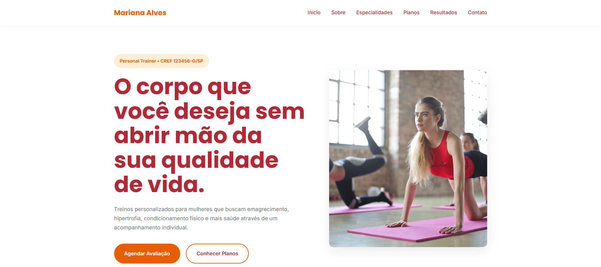

# Mariana Alves | Personal Trainer

## Sobre o projeto
Este projeto consiste em um site institucional fictício desenvolvido para a personal trainer Mariana Alves. O objetivo é transmitir profissionalismo, confiança e credibilidade, apresentando os serviços, planos de acompanhamento, resultados de alunas e facilitando o contato para novos agendamentos.

O site foi desenvolvido como um projeto de portfólio para praticar a construção de uma aplicação web completa utilizando apenas tecnologias nativas da web, com foco em organização do código, responsividade e experiência do usuário.

## Preview

-- ou -- [Ver projeto ao vivo](https://seulink.github.io/nome-do-projeto)

## Tecnologias utilizadas
- HTML5
- CSS3
- JavaScript (ES6+)
- Google Fonts
- Unsplash (imagens)

## Funcionalidades
- Layout totalmente responsivo
- Site multipágina
- Menu hambúrguer para dispositivos móveis
- Header fixo durante a navegação
- Scroll suave
- Contadores animados
- Cards com animações de entrada
- Carrossel de depoimentos em JavaScript puro
- FAQ em formato de acordeão
- Formulário com envio direto para o WhatsApp
- Botão flutuante de WhatsApp
- Botão "Voltar ao topo"
- Mapa incorporado
- Navegação intuitiva entre páginas

## O que aprendi / O que pratiquei
Durante o desenvolvimento deste projeto pratiquei a criação de um site institucional completo utilizando HTML, CSS e JavaScript puro, sem o auxílio de frameworks.

Também aprofundei conhecimentos em:

- Organização de projetos multipágina
- Estruturação semântica com HTML5
- CSS Grid e Flexbox para construção dos layouts
- Responsividade para diferentes tamanhos de tela
- Criação de componentes reutilizáveis
- Manipulação do DOM com JavaScript
- Intersection Observer para animações de entrada
- Desenvolvimento de um carrossel de depoimentos
- Implementação de FAQ utilizando acordeão
- Integração de formulário com WhatsApp
- Boas práticas de organização e separação de responsabilidades entre HTML, CSS e JavaScript

## Como rodar localmente
1. Clone o respositório
```bash
git clone https://github.com/seuusuario/nome-do-projeto
```
2. Abra o arquivo index.html no navegador

## Autora
Maria Eduarda Milan - Desenvolvedora Web